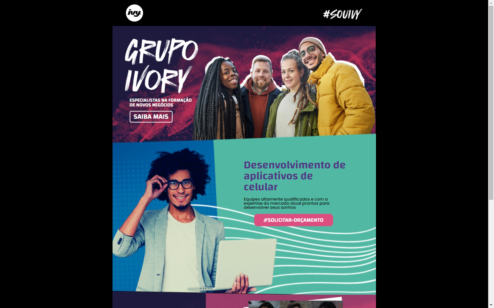

# Multilanguage README Choose your language

 

# <h1 align="center">

# 💻 LandPage - Grupo Ivory

# </h1>

## <h4 align="center"><a href="https://grupo-ivory.vercel.app/">Click to Visit the Website</a></h4>

## 📚 LandPage

The website was developed with a community design, serving as a portfolio.

---

## 💼 Technologies Used

For the development of this website, I used the following technologies:

-   HTML;
-   Sass;

---

## Next Steps

-   [x] Add index
-   [x] Add README
-   [ ] Add responsiveness for mobile devices
-   [x] Add responsiveness for tablets
-   [ ] Improve SEO

---

<h2>🦄 Author</h2>

<table>
  <tr>
    <td align="center">
      <a href="https://github.com/PasqualiRafael">
         
        
          <b>Pasquali</b>
        
      </a>
    </td>
  </tr>
</table>
